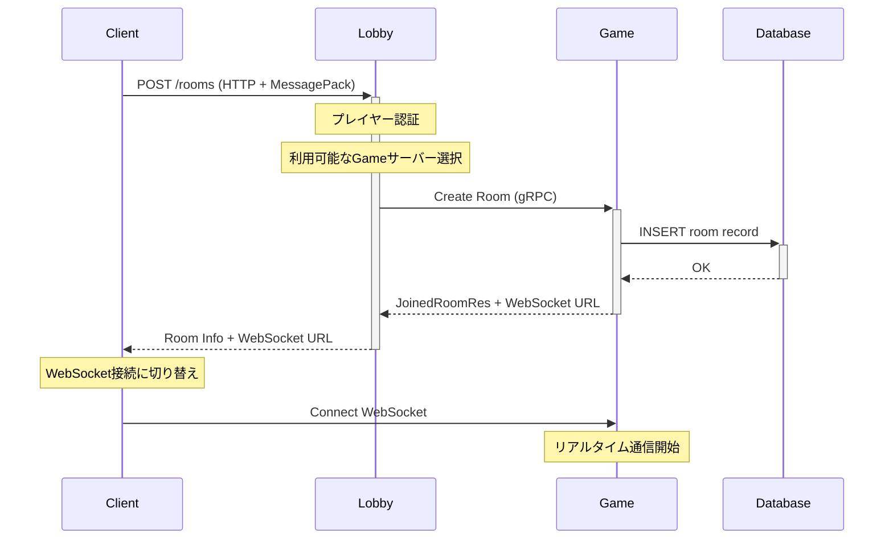
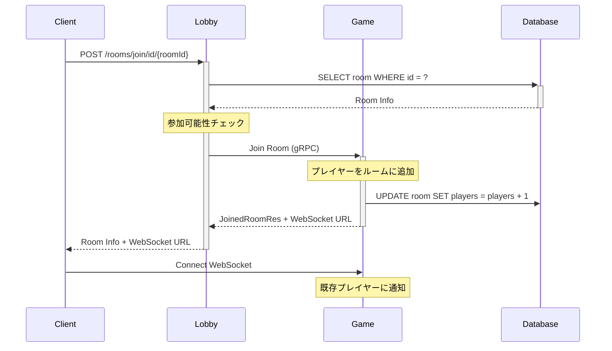
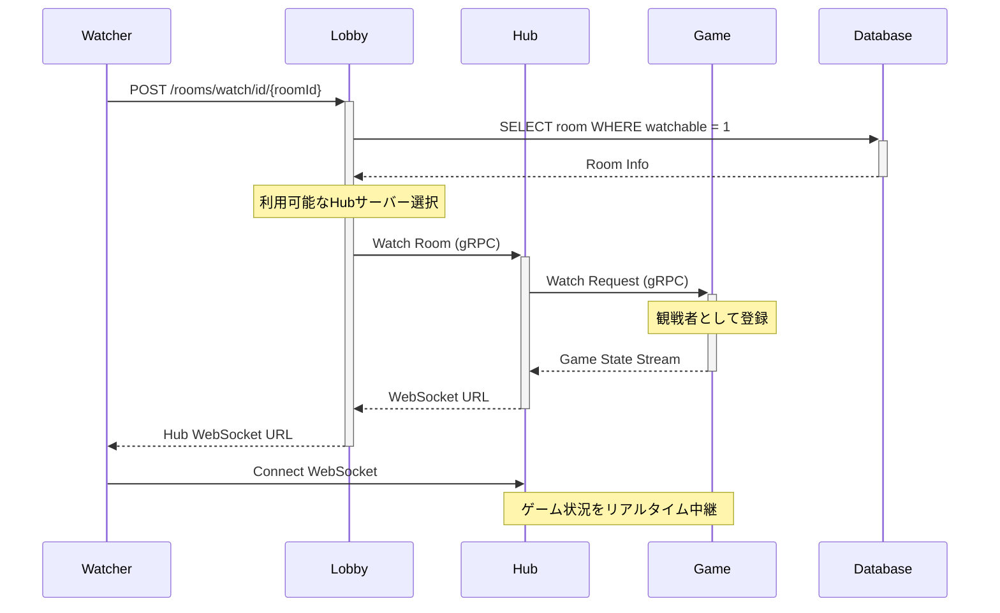
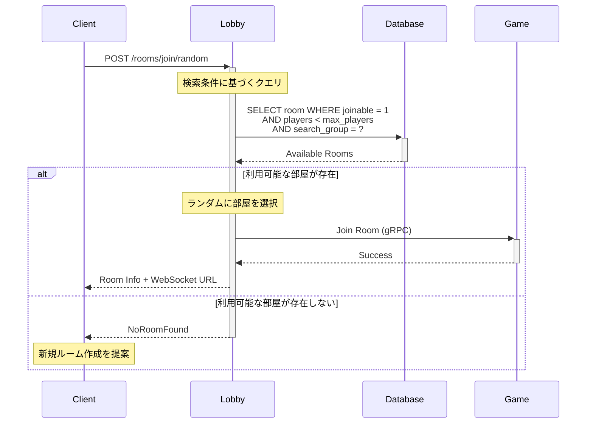
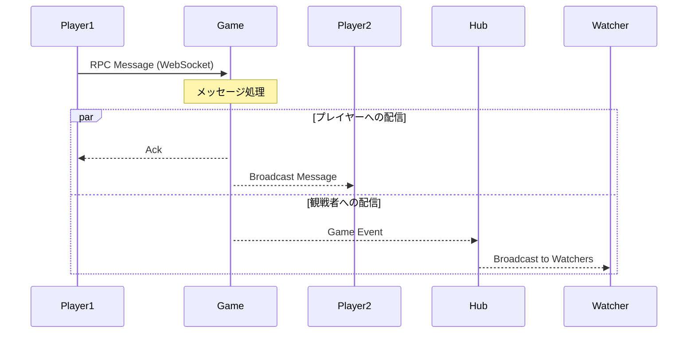
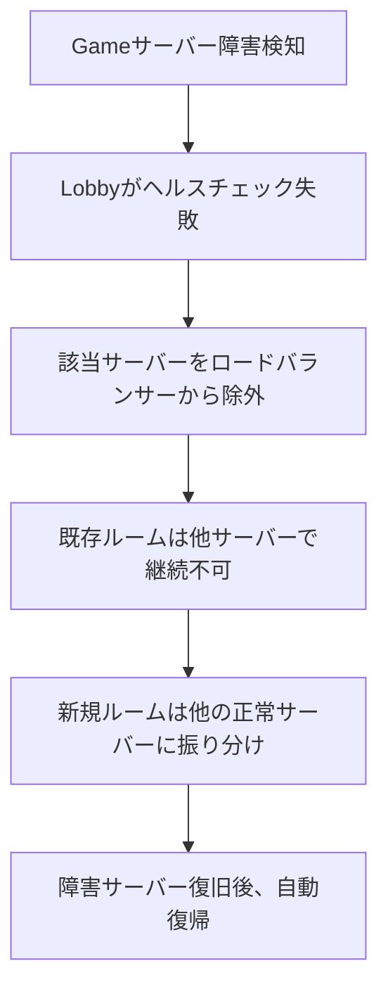
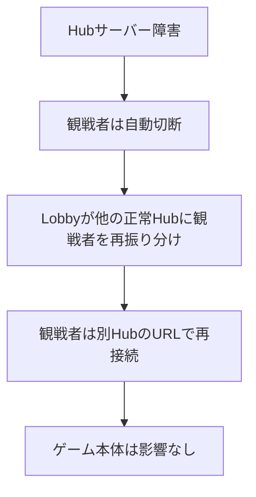
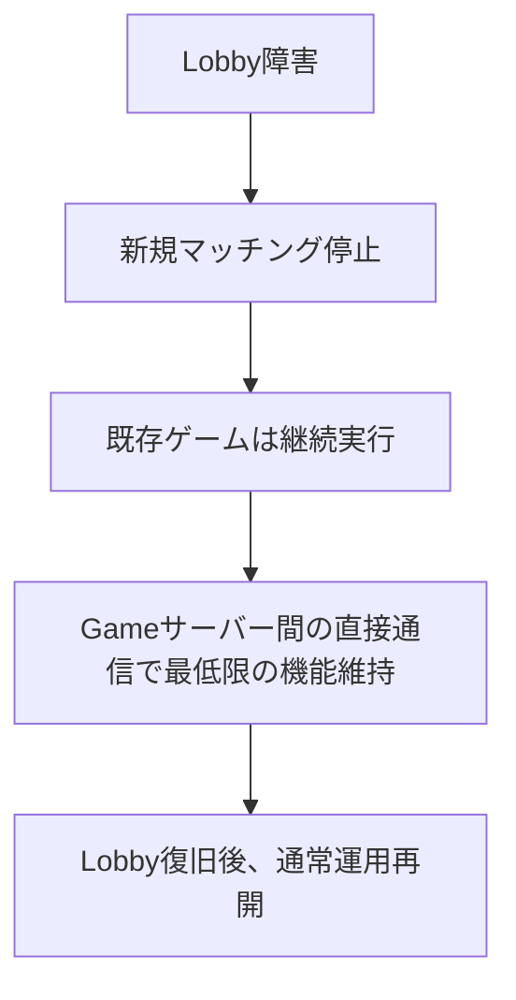
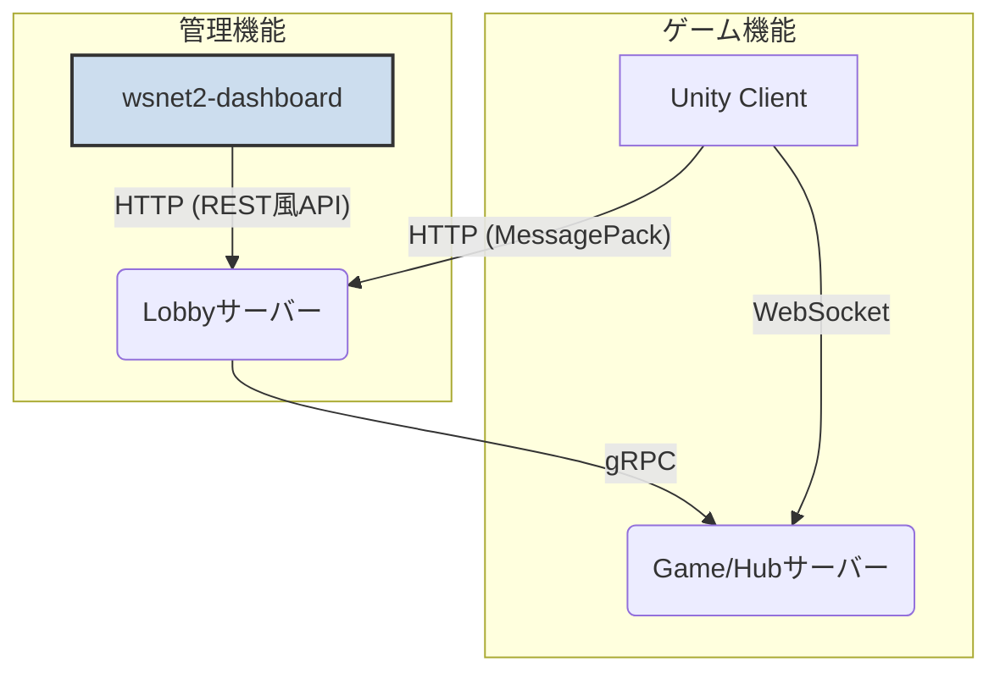

# WSNet2 サーバーアーキテクチャ

## 概要

WSNet2は、リアルタイムマルチプレイヤーゲーム向けの分散サーバーシステムです。3つの主要サーバーと1つのデータベースで構成され、それぞれが特定の役割を担うことで高いスケーラビリティと信頼性を実現しています。

## サーバー構成

### 1. Lobbyサーバー (wsnet2-lobby)

**ポート**: 8080  
**役割**: マッチングとルーム管理の中央制御

#### 主な機能
- **プレイヤー認証**: AppID/Key による認証
- **ルーム管理**: 作成、検索、参加、削除
- **マッチング**: ランダム入室、条件指定マッチング
- **ロードバランシング**: 利用可能なGameサーバーへの振り分け
- **観戦管理**: Hubサーバーへの観戦者振り分け

#### API エンドポイント
```http
POST /rooms                    # ルーム作成
POST /rooms/join/id/{id}       # ID指定参加
POST /rooms/join/number/{num}  # 番号指定参加
POST /rooms/join/random        # ランダム参加
POST /rooms/search             # ルーム検索
POST /rooms/watch/id/{id}      # 観戦開始
```

#### 通信プロトコル
- **クライアント**: HTTP + MessagePack
- **内部通信**: gRPC (Game/Hubサーバーとの通信)

### 2. Gameサーバー (wsnet2-game)

**ポート**: 8000 (WebSocket), 19000 (gRPC)  
**役割**: リアルタイムゲーム処理とプレイヤー通信

#### 主な機能
- **リアルタイム通信**: WebSocketによる双方向通信
- **ルーム実行**: 実際のゲームセッション管理
- **メッセージ配信**: プレイヤー間のRPC通信
- **ゲーム状態管理**: ルーム状態、プレイヤー状態の管理
- **観戦配信**: Hubサーバーへのゲーム状況配信

#### 管理するエンティティ
```go
type Room struct {
    players     map[ClientID]*Client    // プレイヤー管理
    master      *Client                 // マスタープレイヤー
    watchers    map[ClientID]*Client    // 観戦者管理
    publicProps  binary.Dict            // 公開プロパティ
    privateProps binary.Dict            // 非公開プロパティ
}
```

#### 通信プロトコル
- **クライアント**: WebSocket (バイナリメッセージ)
- **内部通信**: gRPC (Lobbyサーバーからの指示受信)

### 3. Hubサーバー (wsnet2-hub)

**ポート**: 8001 (WebSocket), 19001 (gRPC)  
**役割**: 観戦機能の提供とスケーラブルな配信

#### 主な機能
- **観戦専用通信**: 観戦者向けWebSocket接続
- **ゲーム状況中継**: Gameサーバーからの状況を観戦者に配信
- **スケーラブル観戦**: 大量の観戦者を効率的に処理
- **負荷分散**: 複数Hubで観戦者を分散処理

#### 特徴
- **読み取り専用**: ゲームに影響を与えない
- **水平スケール**: 観戦者数に応じてHub数を増加可能
- **ゲーム分離**: Gameサーバーの負荷を軽減

#### 通信プロトコル
- **観戦者**: WebSocket (読み取り専用)
- **内部通信**: gRPC + WebSocket (Gameサーバーからの状況受信)

### 4. データベース (MySQL)

**ポート**: 3306  
**役割**: 永続化データの管理

#### 主要テーブル
```sql
-- ルーム情報
CREATE TABLE `room` (
  `id` char(26) NOT NULL,
  `app_id` varchar(255) NOT NULL,
  `host_id` int(10) unsigned NOT NULL,    -- どのGameサーバーにあるか
  `visible` tinyint(1) NOT NULL,
  `joinable` tinyint(1) NOT NULL,
  `watchable` tinyint(1) NOT NULL,
  `search_group` int(10) unsigned NOT NULL,
  `max_players` int(10) unsigned NOT NULL,
  `players` int(10) unsigned NOT NULL,
  `watchers` int(10) unsigned NOT NULL,
  `public_props` longblob,
  `private_props` longblob,
  PRIMARY KEY (`id`)
);

-- アプリケーション情報
CREATE TABLE `app` (
  `id` varchar(255) NOT NULL,
  `key` varchar(255) NOT NULL,
  PRIMARY KEY (`id`)
);

-- Gameサーバー情報
CREATE TABLE `game_server` (
  `id` int(10) unsigned NOT NULL,
  `hostname` varchar(255) NOT NULL,
  `grpc_port` int(10) unsigned NOT NULL,
  `websocket_port` int(10) unsigned NOT NULL,
  PRIMARY KEY (`id`)
);
```

## アーキテクチャフロー

### 1. ルーム作成フロー



### 2. ルーム参加フロー



### 3. 観戦フロー



### 4. ランダムマッチングフロー



### 5. メッセージ配信フロー



## スケーラビリティ設計

### 水平スケーリング

```
                    ┌─────────────┐
                    │   Lobby     │ (Single Point)
                    │   Server    │
                    └─────────────┘
                           │
                    ┌──────┼──────┐
                    │      │      │
            ┌───────▼──┐ ┌─▼──┐ ┌─▼──┐
            │ Game     │ │Game│ │Game│ (Multiple)
            │ Server 1 │ │ 2  │ │ 3  │
            └─────┬────┘ └────┘ └────┘
                  │
            ┌─────┼─────┐
            │     │     │
        ┌───▼─┐ ┌─▼─┐ ┌─▼─┐
        │Hub 1│ │Hub│ │Hub│ (Multiple)
        │     │ │ 2 │ │ 3 │
        └─────┘ └───┘ └───┘
```

### 負荷分散戦略

1. **Gameサーバー分散**
   - Lobbyが利用可能なGameサーバーを自動選択
   - CPUやメモリ使用率による動的分散
   - 部屋数上限による制御

2. **Hub分散**
   - 観戦者数に応じてHubサーバーを動的追加
   - 地理的分散による遅延最適化
   - ゲームごとの観戦者数制限

3. **データベース最適化**
   - 読み取り専用レプリカ
   - インデックス最適化
   - 接続プール管理

## 通信プロトコル詳細

### HTTP API (Lobby)

```http
# ルーム作成
POST /rooms HTTP/1.1
Host: localhost:8080
Content-Type: application/x-msgpack
Wsnet2-App: testapp
Wsnet2-User: user001
Wsnet2-HMac: [HMAC signature]

[MessagePack encoded CreateParam]
```

### WebSocket (Game/Hub)

```
# 接続
WebSocket: ws://localhost:8000/room/{roomId}
Headers:
  Wsnet2-App: testapp
  Wsnet2-User: user001
  Authorization: Bearer {authKey}
  Wsnet2-LastEventSeq: 0

# メッセージフォーマット
[1byte: MessageType][Payload: MessagePack]
```

### gRPC (内部通信)

```protobuf
service Game {
  rpc Create(CreateRoomReq) returns (JoinedRoomRes);
  rpc Join(JoinRoomReq) returns (JoinedRoomRes);
  rpc Watch(JoinRoomReq) returns (JoinedRoomRes);
  rpc GetRoomInfo(GetRoomInfoReq) returns (GetRoomInfoRes);
  rpc Kick(KickReq) returns (Empty);
}
```

## 障害処理とフェイルオーバー

### 1. Gameサーバー障害



### 2. Hub障害



### 3. Lobby障害



## モニタリングとメトリクス

### 監視項目

1. **接続数監視**
   ```go
   metrics.Conns.Add(1)        // WebSocket接続数
   metrics.Rooms.Set(roomCount) // アクティブルーム数
   ```

2. **レスポンス時間**
   ```go
   start := time.Now()
   // 処理実行
   metrics.ApiDuration.Observe(time.Since(start).Seconds())
   ```

3. **エラー率**
   ```go
   metrics.ErrorCount.WithLabelValues("lobby", "create_room").Inc()
   ```

### ログ構造化

```go
logger := log.GetLoggerWith(
    log.KeyHandler, "grpc:Create",
    log.KeyApp, appId,
    log.KeyClient, clientId,
    log.KeyRoom, roomId,
    log.KeyRequestedAt, timestamp,
)
```

## セキュリティ

### 認証フロー

1. **アプリケーション認証**: AppID/Key による事前認証
2. **MAC認証**: HMACによるメッセージ改ざん検証
3. **セッション管理**: WebSocket接続用の一時認証キー
4. **暗号化**: TLS/WSS での通信暗号化

### アクセス制御

```go
// プレイヤーの操作権限チェック
if !room.IsPlayer(clientId) {
    return codes.PermissionDenied
}

// 観戦者の読み取り専用制御
if client.IsWatcher() && message.Type != ReadOnlyMessage {
    return codes.PermissionDenied
}
```

## パフォーマンス最適化

### 1. メッセージ最適化

- **バイナリプロトコル**: MessagePack による効率的シリアライゼーション
- **差分更新**: 変更分のみ送信
- **バッチ処理**: 複数メッセージの一括処理

### 2. 接続最適化

- **接続プール**: gRPC接続の再利用
- **Keep-Alive**: WebSocket接続の維持
- **圧縮**: メッセージ圧縮による帯域削減

### 3. データベース最適化

- **インデックス**: 検索クエリの最適化
- **接続プール**: DB接続の効率的管理
- **キャッシュ**: 頻繁アクセスデータのメモリキャッシュ

## まとめ

WSNet2のサーバーアーキテクチャは、以下の原則に基づいて設計されています：

1. **責任分離**: 各サーバーが明確な役割を持つ
2. **スケーラビリティ**: 需要に応じた水平スケーリング
3. **可用性**: 単一障害点の排除と自動復旧
4. **パフォーマンス**: 最適化された通信プロトコル
5. **セキュリティ**: 多層防御による堅牢性

この設計により、小規模から大規模まで、様々なゲームの要求に対応できる柔軟で信頼性の高いシステムを実現しています。

## 5. 管理ダッシュボード (wsnet2-dashboard)

**役割**: サーバーの状態監視と管理を行うWebインターフェース

### 構成

- **フロントエンド**: Vue.js (Vite, Naive UI)
- **通信**: HTTP (REST風API)
- **ターゲットサーバー**: **Lobbyサーバー**

### アーキテクチャと通信フロー

管理ダッシュボードは、専用のBFF (Backend for Frontend) を持たず、**Lobbyサーバーが提供するAPIを直接呼び出します。**

Lobbyサーバーは、通常のゲームクライアント向けのマッチング機能に加え、サーバーの状態を取得したり、特定のプレイヤーを強制退出させたりといった管理者向けのAPIも提供しています。



### 接続設定

ダッシュボードが接続するLobbyサーバーのアドレスは、フロントエンドの `.env` ファイルまたはブラウザのローカルストレージで設定されます。

- **デフォルト設定**: `.env` ファイルの `VITE_DEFAULT_SERVER_URI` で定義 (例: `http://localhost:5555`)
- **実行時設定**: ダッシュボードの「Settings」画面から、任意のLobbyサーバーアドレスに変更可能。

この構成により、ダッシュボードは開発環境や本番環境など、異なる場所で稼働しているLobbyサーバーに接続して、サーバー群の状態をリモートで管理することができます。

